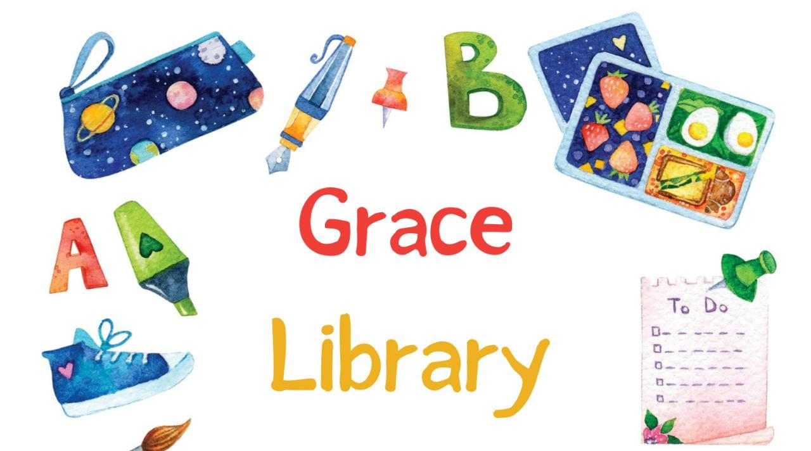

# Grace Library

Grace Library es un e-commerce diseñado para amantes de la lectura y la escritura. Ofrecemos una amplia gama de artículos de librería, desde cartucheras y cuadernos hasta bolígrafos y accesorios para la organización. Nuestro objetivo es brindar una experiencia de compra conveniente y agradable para los entusiastas de la literatura y la creatividad.

## Herramientas/Librerias utilizadas

- React-Bootstrap
- Sweet-Alert
- Firestore

## Detalles

-Fueron utilizadas las librerias previamente detalladas para dar estilo a los componentes como botones y formularios.

-Se utilizó Firestore para simular la subida y descarga de datos relevantes al proyecto, tales como lo son el catálogo de producto y la generación de la orden de compra, que contiene los datos del cliente y el pedido realizado por el mismo.

## Finalidad

Este proyecto fue entregado como proyecto final para el curso de React-JS dictado en Coderhouse, donde podrás simular la compra de productos de librería, y al finalizar la misma te pedirá tus datos para luego brindarte una orden de compra.

## Autor

- [@alandbarcos](https://www.github.com/alandbarcos)

